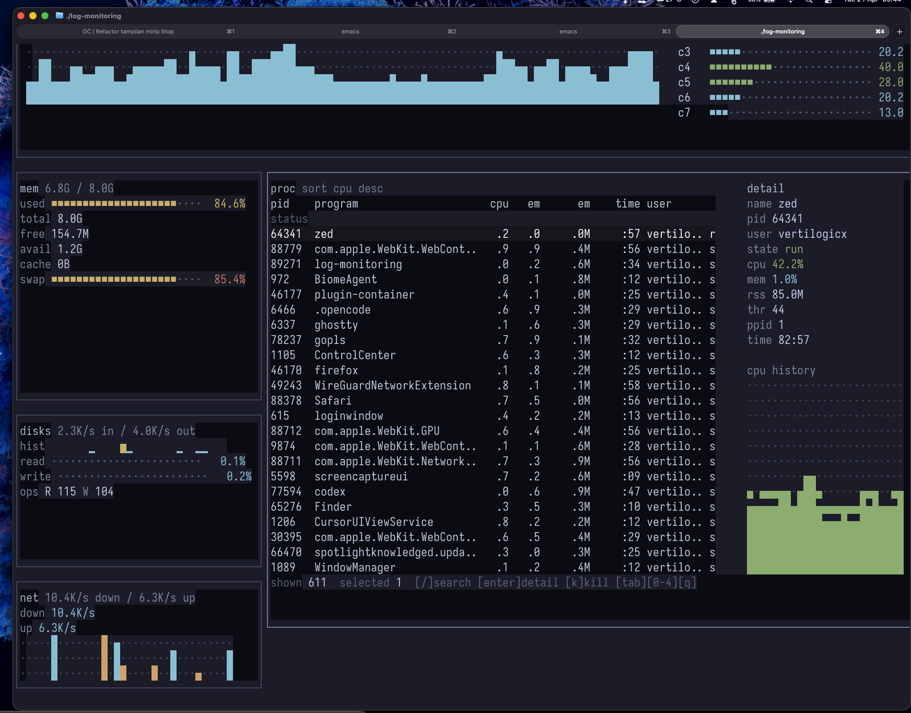

# btop-go

A system resource monitor written in Go with Bubble Tea, inspired by btop.



## Features

- **CPU Monitor**: Total and per-core CPU usage
- **Memory Monitor**: Used, free, available, and total memory with visualization
- **Disk I/O Monitor**: Read/write speeds
- **Network Monitor**: Upload/download speeds
- **Process Monitor**: List of running processes with sorting

## Controls

- `q` / `ctrl+c` / `esc`: Quit
- `c`: Switch to CPU panel
- `m`: Switch to Memory panel
- `d`: Switch to Disk panel
- `n`: Switch to Network panel
- `p`: Switch to Processes panel
- `tab`: Cycle through panels
- `space`: Pause/Resume updates
- `↑`/`↓` or `k`/`j`: Navigate process list

## Installation

```bash
go build -o btop-go .
```

## Usage

```bash
./btop-go
```

## Architecture

```
.
├── internal/
│   ├── app/          # Bubble Tea application model
│   ├── collector/    # System metrics collectors
│   │   ├── cpu.go
│   │   ├── memory.go
│   │   ├── disk.go
│   │   ├── network.go
│   │   └── process.go
│   └── types/        # Shared type definitions
└── main.go
```

## Dependencies

- [bubbletea](https://github.com/charmbracelet/bubbletea): TUI framework
- [lipgloss](https://github.com/charmbracelet/lipgloss): Styling
- [gopsutil](https://github.com/shirou/gopsutil/v4): System metrics

## TODO

- Add process killing functionality
- Add process filtering
- Add color themes
- Add graphs
- Add battery monitoring
- Add mouse support
- Add configuration file